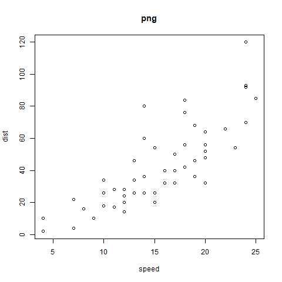

\mainmatter

# 详细介绍

[R语言学习笔记--R bookdown图表设置中英文双标题](https://www.jianshu.com/p/addd3a2bdf27)

# 图片双标题 {#intro}

## 生成图片

```{r}
  dir.create('images')
  png('images/fig.png')
  plot(cars, main = 'png')
  dev.off()
  pdf('images/fig.pdf')
  plot(cars, main = 'pdf')
  dev.off()
```

## 插入图片

方案一：

```{r fig1, out.width='50%', fig.cap="中文题目", bicap='English caption', fig.align="center"}
  
```
`images`文件夹中同时存在`fig.pdf`文件，生成pdf文档时，`knitr`会自动调用`fig.pdf`文件，如此生成高质量的pdf文件。

(ref:fig2) 试试**复杂格式**的中文题目`cars` 

```{r fig2, out.width='50%',fig.cap='(ref:fig2)', bicap = "English caption2", fig.align="center"}
 
```

方案二：

\begin{figure}
```{r, out.width='50%', fig.align="center", echo = FALSE}
  
```
\bicaption{在不同调谐因子\textit{k}下的缺损文件可比较性实验结果}{Incompletele comparable probability in different factor k}
\label{fig:fig3}
\end{figure}


```{r fig3, echo = FALSE, out.width='50%', fig.align="center", fig.cap="在不同调谐因子k下的缺损文件可比较性实验结果"}
  library(knitr)
  if(is_html_output()) 
```

# 表格双标题 {#table}

\begin{table}[!htbp]
	\centering
	\bicaption{表中文题目}{Table English caption}
	\label{tab:Tab1}
  ```{r, echo = FALSE}
  knitr::kable( head(iris), booktabs = TRUE)
  ```
\end{table}

```{r Tab1, echo = FALSE}
  library(knitr)
  if(is_html_output()) knitr::kable(head(iris), caption = "表中文题目", booktabs = TRUE)
```


